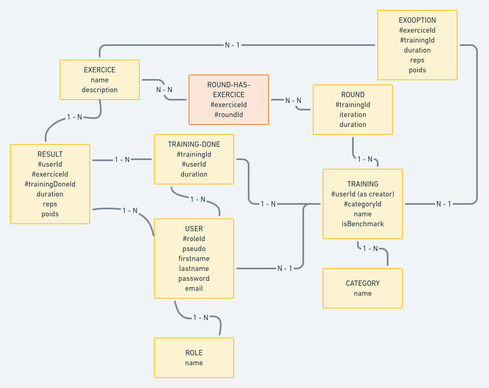

# CHRONOFIT-API

## Besoins

Une application accessible sur le web, qui doit permettre de créer et lire des entrainements sportifs.
Les entrainements sont, pour la première version, une liste d'exercices à réaliser.
Chaque exercice a :
* Un nom,
* Une description, 
* Une durée,
* Un nombre de répétition (facultatif),
* Une charge (facultative),

Les entrainements enregistrés dans l'API sont considérés 'benchmark' dans le sens ou ils peuvent être comparés, en terme de durée globale, de nombre de répétitions et / ou de charge.

Certains exercices de base dit 'benchmark' également sont comparés en terme de nombre de répétitions et charge moyenne sur une période donnée.

## User Cases

Les différents utilisateurs :
* L'utilisateur non identifié, (accès en lecture API)
* L'utilisateur identifié, a un compte, (droit sup + écriture en localStorage),
* Le coach (droits sup + CRUD API sur ses entrainements).
* L'admin (droits sup + CRUD API sur tous les entrainements)

| En tant que ... | Je veux ... | Afin de ...|
| :---| :---| :---|
| V1 - Utilisateur non identifié | avoir accès à un menu contenant des liens vers les différentes parties de l'application | choisir ce que je veux faire
| V1 - Utilisateur non identifié | Avoir accès à des entrainements benchmark, les "Girls" | Pouvoir tester l'application |
| V1 - Utilisateur non identifié | Pouvoir créer un compte | avoir des identifiants pour me logguer
| V1 - Utilisateur non identifié | Pouvoir me logguer avec mes identifiants | Avoir accès aux autres fonctionnalités |
| V1 - Utilisateur identifié | avoir accès à une page profil | Pouvoir modifier mes infos personnelles |
| V1 - Utilisateur identifié | Pouvoir créer des entrainements (cf détails ci-dessous)| Avoir des entrainements personnalisés |
| V1 - Utilisateur identifié | Enregistrer une trame d'entrainement | Pouvoir refaire un entrainement que j'ai créé |
| V2 - Utilisateur identifié | Enregistrer mes performances à un entrainement | garder un enregistrement |
| V2 - Utilisateur identifié | Avoir une vue graphique de l'évolution de mes performances sur les entrainement benchmark et exercices benchmarks | Pouvoir juger de ma progression |
| V2 - Coach | Pouvoir créer un entrainement benchMark (ou non) | Proposer un suivi personnalisé |
| V2 - Coach | Pouvoir assigner un entrainement à un utilisateur | Proposer un suivi personnalisé |

Afin de créer un entrainement

| En tant que ... | Je veux ... |
| :---| :---|
| V1 - Utilisateur identifié | Pouvoir ajouter un exercice 
| V1 - Utilisateur identifié | Pouvoir supprimer un exercice 
| V1 - Utilisateur identifié | Pouvoir préciser pour chaque exercice : son nom, une description, le nombre de rounds, de répétitions, la durée, le poids |
| V1 - Utilisateur identifié | Pouvoir grouper plusieurs exercices ensemble | 
| V1 - Utilisateur identifié | Pouvoir dégrouper un groupe d'exercices | 
| V1 - Utilisateur identifié | Pouvoir déplacer les exercices en drag and drop dans un groupe | 
| V1 - Utilisateur identifié | Pouvoir déplacer les groupes en drag and drop dans la trame d'entrainements | 

Afin de me chronométrer

| En tant que ... | Je veux ... |
| :---| :---|
| Utilisateur | Avoir et enregistrer le temps passé à l'entrainement, un chrono général |
| Utilisateur | Avoir et enregistrer le temps passé sur chaque exercice, le chrono suivant se déclenche sur action utilisateur ou fin de chrono d'exo précédent |
| Utilisateur | Avoir et enregistrer le temps passé pour chaque groupe d'exercice |

## Versions déployées
v0.1:
API: les endpoints renvoient des données.
React: Les composants Training sont connectés, on peut afficher les trainings en BdD.

v0.2:
?

## MCD

A ce stade, les différentes entités identifiées :
* training,
* training-has-exercice (table d'association many to many),
* training-done,
* exercice,
* result,
* category,
* user,
* role,

Les rôles :
* public : utilisateur non-identifié,
* authenticated : utilisateur connecté, peut CRUD des exercices et entrainements en local,
* coach : 'authenticated' + peut CRUD ses entrainements et exercices dans l'API et les lier à un user.
* admin : 'coach' + peut CRUD tous les entrainements et exercices,

Le _authenticated_ peut lire mais pas écrire dans la base de données.
L'_admin_ quand à lui est un coach sans restriction sur l'auteur.

## FAQ
### Comment créer ou modifier un entrainement ?
L'utilisateur a accès à une vue permettant de :
* Créer un entrainement vide (ou modifier une entrainement existant et l'enregistrer sous un autre nom),
* Créer un exercice à partir de la liste des exos 'benchmark' ou un nouvel exercice en précisant ses paramétres (durée, nb de reps, charge, description + nom pour les exos non-benchmark),
* Ajouter cet exercice et les suivants dans la liste d'exo du training,
* Enregistrer l'entrainement (en local ou DB selon les droits),

### Comment suivre un entrainement ?
Depuis la vue qui permet de créer, modifier ou charger un entrainement, la time-line est remplie avec les exercices sélectionnés.
On valide, ce qui affiche la vue permettant de suivre l'enchainement des exercices prévus.

### Comment enregistrer ses performances ?
Selon le type d'exercice, le nombre de reps effectué et la charge ont pu être modifiés.
Ces informations ainsi que le temps total de l'entrainement peuvent être enregistrés à la fin de l'entrainement (donné soit par la fin du dernier exercice chronométré, soit par le fait de quitter la vue d'entrainement par la croix).
On crée alors un enregitrement 'training_done' qui contient :
* Le nom du sportif,
* Une référence au training d'origine, 
* Une liste d'exercice (contient les infos décrites ci-dessus) au format json.

### Comment comparer les perfs aux entrainements faits ? Comment visualiser les améliorations ?
Une vue personnalisée affiche les statistiques (à définir plus finement avec de la data), qui contiendrait entre autre :
* Le temps total passé en entrainement pour plusieurs durées type (aujourd'hui, semaine, mois, année...) ?
* Le nombre de répétitions pour les entrainements benchmark, avec indication du poids moyen ?
* Les maxs aux exos benchmarks prévus ?
* Un graph sur différentes durées affichant l'historique pour un exo benchmark, les maxs ?

## Stack technique

Front : _React_ + _Redux_

Communique avec une API REST :

_Node + Express + Sequelize + postgreSQL_

Développement en local puis quand il sera temps, hébergement chez Gandi sur instance Node.

